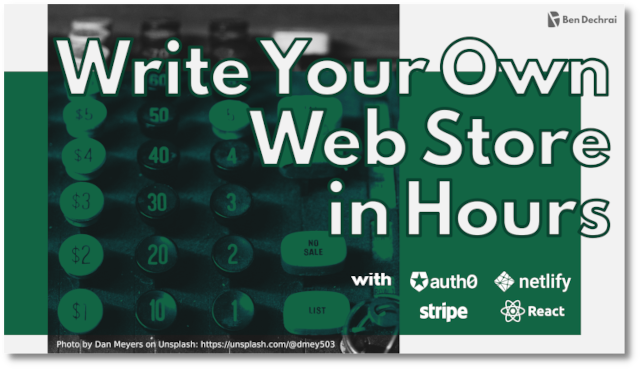

# Write Your Own Web Store In Hours

This project is the basis of [Ben Dechrai](https://bendechrai.com/)'s workshop by the same name.

By the end of this workshop, you will have created a React-based Single Page Application that allows customers to log in using Auth0, and can list and purchase a number of products based on the product catalogue defined in your Stripe account.

## :technologist: Prerequisites

In order to get the most from this workshop, you will

- be comfortable using VS Code as a development environment
- have a moderate understanding of JavaScript

## 🗝 Key

| Symbol(s) | Description                                                                                                                                              |
| :-------: | :------------------------------------------------------------------------------------------------------------------------------------------------------- |
|  👉💻👈   | Skip past the descriptions and explanations, and just get straight to the action items. Each action that you need to take is prefixed with these symbols |
|    💡     | Helpful hints or things you might want to pay attention to                                                                                               |
|    🎉     | Milestone - do something here to verify you're in track                                                                                                  |
|    🧪     | Checkpoint - an optional time for you to do a test to see your progress                                                                                  |

## :book: Workshop Steps

0. [Pre-Workshop Setup](STEP-0-PRE-WORKSHOP.md)
1. [Setting up your development environment](STEP-1-DEVELOPMENT-ENVIRONMENT.md)
2. [Create a new React Project](STEP-2-NEW-REACT-PROJECT.md)
3. [Defining products in Stripe](STEP-3-DEFINING-PRODUCTS-IN-STRIPE.md)
4. [Retrieving products from the Stripe API](STEP-4-RETRIEVE-PRODUCTS.md)
5. [Displaying products in React](STEP-5-DISPLAY-PRODUCTS.md)
6. [Authenticating users](STEP-6-AUTHENTICATING-USERS.md)
7. [Connecting Auth0 to Stripe](STEP-7-CONNECTING-AUTH0-TO-STRIPE.md)
8. [Augmenting Access Tokens](STEP-8-AUGMENTING-THE-ACCESS-TOKENSTARTING-A-STRIPE-CHECKOUT.md)
9. [Starting a Stripe Checkout](STEP-9-START-CHECKOUT.md)
10. [Complete! Testing the site...](STEP-A-COMPLETION.md)
