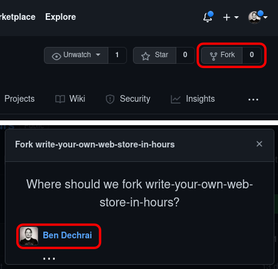
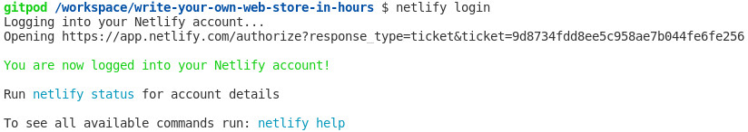

# Write Your Own Web Store In Hours

⚠️ **Note**

You're welcome to do this before the workshop too, but we will start here as a group anyway.


## 🍽️ Fork This Repository

> A fork is a copy of a repository. Forking a repository allows you to freely experiment and commit changes without affecting the original project.

👉💻👈 Click the Fork button in the top right, and select where to fork it to.

💡 If you are a member of any Github organisations, you might be prompted to choose between forking to your personal account or to one of your organisations, as shown below. If you're not sure which to choose, then it's likely your personal account is the best place to fork to.




## 💻 Start Your Gitpod Development Environment

The hardest part with workshops is getting your development environment ready. Fear not. We're using Gitpod for this.

> 
>
> Gitpod lets you spin up fresh, automated dev environments for each task, in the cloud, in seconds. The free tier gives you 50 hours of usage per month.

👉💻👈 Prefix the URL in the address bar with `gitpod.io/#`

So if you've cloned this to:

```
https://github.com/yourname/write-your-own-web-store-in-hours
```

you'll want to go to:

```
https://gitpod.io/#github.com/yourname/write-your-own-web-store-in-hours
```

and you'll end up with something looking like this:


## ⚙️ Connect to Netlify

We're not going to be deploying to Netlify, but we do want to use the Netlify developer tools so that the lambda functions we write today work locally.

👉💻👈 In Gitpod's web-based editor, open the command terminal and install Netlify's command line (CLI) tools

```shell
npm install netlify-cli -g
```

👉💻👈 Log the Netlify CLI in to your Netlify account

```shell
netlify login
```

Once complete, you'll see the message `You are now logged into your Netlify account!` in the terminal.



💡 Due to the way Gitpod works, you might notice the Netlify login page trying to open in the preview area and fail. If this happens, click on the "Open Site in New Window" button and continue. This step will be complete when you can run `netlify status` in the Gitpod's command terminal and not see `Not logged in. Please log in to see site status.`
