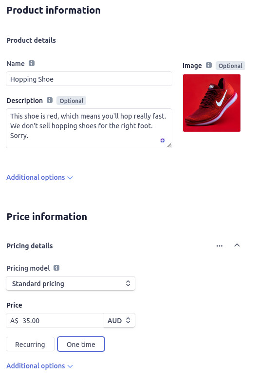

# Write Your Own Web Store In Hours

## Defining your Product Catalogue

Let's add a couple of items to your Stripe product catalogue. You can choose whatever you like, but if you're stuck for ideas, there are a handful of images in the `/workshop-assets/stripe-product-images` folder that I grabbed from [Unsplash](https://unsplash.com/) to give you inspiration.

> If you source your own images, ensuring they're 400px by 400px will make this workshop's suggested CSS work nicely. The images I've provided have been pre-cropped to these dimensions for you already.

👉💻👈 From the [Product Creation Page](https://dashboard.stripe.com/test/products/create) in your Stripe Dashboard, make sure to add at least two products:

- Provide the optional description - we'll display this in our product details page later.
- Include an image.
- Choose the "Standard pricing" model and define it as a "One time" payment.

> 📷 **_Screenshot of an example product being added to Stripe_**
>
> 

---

[▶️ STEP 4: Retrieving products from the Stripe API](./STEP-4-RETRIEVE-PRODUCTS.md)

_[⎌ Back to step 2: Create a new React Project](./STEP-2-NEW-REACT-PROJECT.md)_
