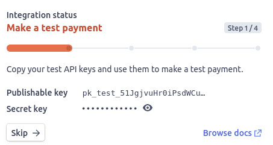

# Write Your Own Web Store In Hours


## Creating a Lambda Function and Displaying the Product Catalogue

Our React application is running purely in the browser, which is considered an untrusted environment. This means we cannot connect directly to the Stripe API from React, as that would require us to make the Secret Key public.

So we need to write a little bit of backend code to connect to Stripe securely. Luckily, Netlify will create lambda functions for us that we can connect to both during development and once in production. Any scripts in the `/netlify/functions` folder will be exposed as lambda functions for us to call.

👉💻👈 For this section, we'll need the Stripe module for the backend functions, and the `dotenv` module for managing environment variables in developement. We might as well also grab the Stripe.js module for React.

```shell
npm install stripe @stripe/stripe-js dotenv
```

👉💻👈 Create `/netlify/functions/products.js`

```
const stripe = require('stripe')(process.env.STRIPE_SECRET_KEY);

exports.handler = async function(event, context) {

  // Stripe doesn't give you a list of products with prices,
  // so we'll get all prices with their products. This means
  // products might appear in the results multiple times if
  // they have multiple prices.
  const prices = await stripe.prices.list({
    expand: ['data.product']
  });

  // Let's transform the prices with products
  //        to a list of products with prices
  products = [];
  prices.data.map(price => {

    // Separate product object from price object
    product = price.product;
    delete price.product;

    // Is this product in the array already?
    if(existingProduct = products.find(p => p.id===product.id)) {

      // YES - add the new price to the existing item
      existingProduct.prices.push(price)

    } else {

      // NO - create new object and add to array
      products.push({ ...product, prices: [price] });

    }

  })

  return {
    statusCode: 200,
    body: JSON.stringify(products)
  };

}
```

Now let's define `STRIPE_SECRET_KEY` by creating `/.env`

```
STRIPE_SECRET_KEY=sk_test_......................................
```

To get your secret key, head to the [Developer Section](https://dashboard.stripe.com/test/developers) of your Stripe Dashboard, and you'll see the keys on the right hand side.

> 📷 **_Screenshot of the publishable and secret keys shown in the Stripe Dashboard_**
>
> 

👉💻👈 Restart `netlify dev` in order to load in the environment varliables and register the new function.

🧪 To test that everything's working as expected, head to http://localhost:8888/.netlify/functions/products, and you should see the JSON response and spot some product names and descriptions in there.
