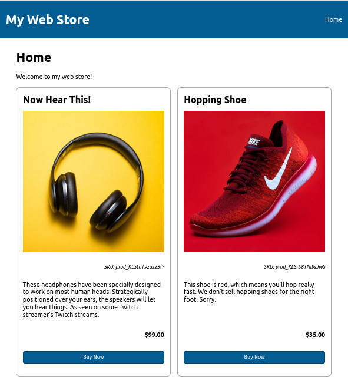

# Write Your Own Web Store In Hours


## Showing Products on the Home Page

If you're familiar with React already, the next part might be pretty straight forward. If not, fear not. Simply copy and paste the code below and you should be right.

But what's it doing? We're going to instruct the Home Page component to connect to the lambda function we just created, retrieve the JSON response of products, and render each of them out. We'll also add a handler for the "Buy Now" buttons.


👉💻👈 Replace the contents of `src/pages/home.js` with:

```javascript
import React, { useEffect, useState } from "react";

const Home = () => {
  const [products, setProducts] = useState();

  useEffect(() => {
    fetch("/.netlify/functions/products")
      .then((res) => res.json())
      .then((json) => {
        setProducts(json);
      });
  }, [setProducts]);

  return (
    <>
      <h1>Home</h1>
      <p>Welcome to my web store!</p>
      <div className="products">
        {products &&
          products.map((product) => {
            return (
              <div className="product" key={product.id}>
                <h2>{product.name}</h2>
                <p className="img">
                  
                </p>
                <p className="sku">SKU: {product.id}</p>
                <p className="description">{product.description}</p>
                <p className="price">
                  ${(product.prices[0].unit_amount / 100)
                    .toFixed(2)}
                </p>
                <p className="buynow">
                  <button>Buy Now</button>
                </p>
              </div>
            );
          })}
      </div>
    </>
  );
};

export default Home;
```

💡 Take a minute to look at this code and comapre it to the description of what we're trying to achieve. You should see the request to the lambda function, and the loop that renders the product information.


🧪 After saving, you should see your homepage automatically update and display the products you added to your Stipe catalogue. If you used the HTML structure in the code above, the CSS file provided with this workshop should even make it all look very pretty...

> 📷 **_Screenshot of an example of what the product listing might look like_**
>
> 


---

[▶️ STEP 6: Authenticating users](./STEP-6-AUTHENTICATING-USERS.md)

_[⎌ Back to step 4: Retrieving products from the Stripe API](./STEP-4-RETRIEVE-PRODUCTS.md)_
