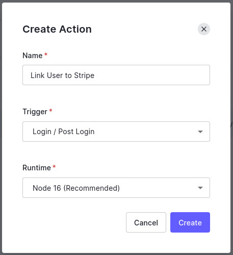
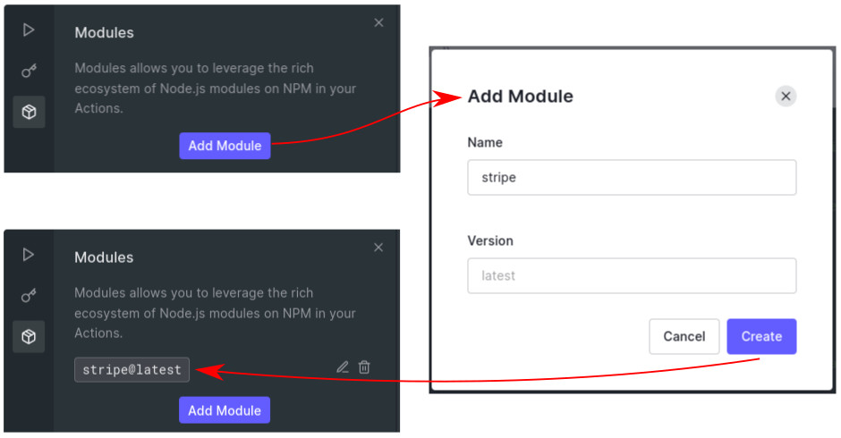
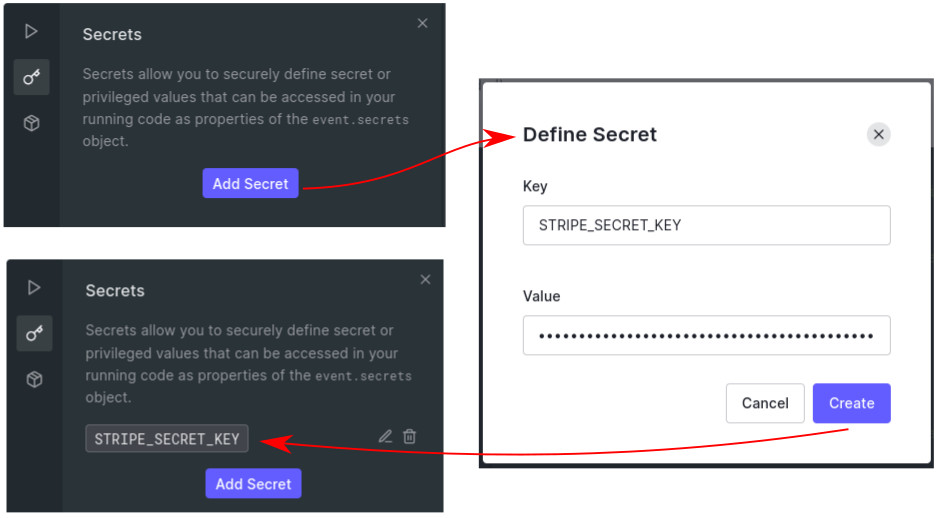
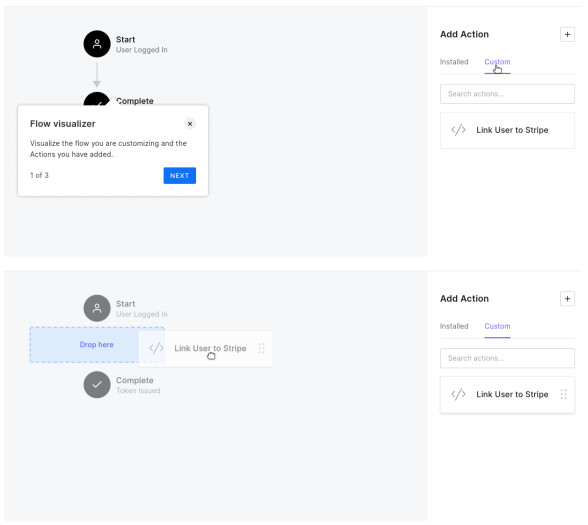
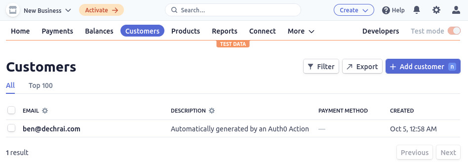
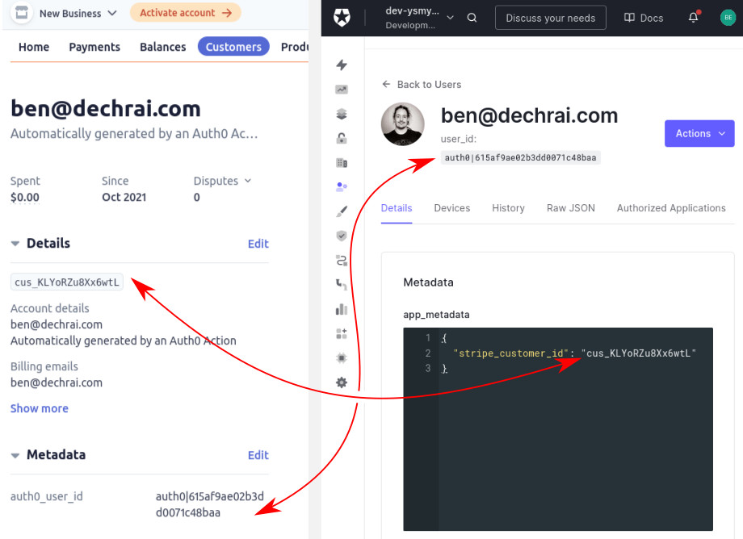

# Write Your Own Web Store In Hours


## Connecting Auth0 and Stripe

> ❗ ❗ READ THIS ❗ ❗
>
> This is arguably the crux of the entire workshop. Adding Auth0 to a React app is straight forward, and nothing overly complex has happened in Stripe.
>
> Normally, you'd probably create a database to link Auth0 users to Stripe customer IDs. But we're not going to do that.
>
> Instead, we're going to get Auth0 to talk directly to Stripe in order to make sure that every user has a customer ID, and then we'll return that ID to the application via the Access token which will be used by our lambda functions.
>
> 💪 LET'S GET TO IT! 💪


## Create an Auth0 Action

Actions are one of the extensibility features of Auth0, that allow you to run your own arbitrary JavaScript code when certain events are triggered. We're going to create an Action that will create a new Customer record in your Stripe tenant, and associate it with the currently logged in user.


👉💻👈 In the Auth0 Dashboard, head to [Actions > Library](https://manage.auth0.com/#/actions/library) in the left menu. From there, click "Build Custom".

Have a quick look at the Triggers. There's one for post-registration, that sounds like a good place for this. After a user registers, run our action.

However, for two main reasons, we're going to use the "Post Login" trigger. Firstly, we have a user already that hasn't had this action run against them. We want to make sure their user profile is still augmented.

Secondly, and similarly, if something goes wrong and we can't connect to Stripe, the process could fail. Using th ePost Login trigger means a user can log out and back in to try again.


👉💻👈 Name the Action (e.g. "Link User to Stripe") and make sure Post Login is selected

> 📷 **_The Auth0 Action Creation modal_**
>
> 


## Install the Stripe SDK

👉💻👈 Did you know that you can install almost any NPM module for use in Actions? Pretty sweet. Let's install the Stripe SDK within the Actions interface:

> 📷 **_Installing Modules for Actions_**
>
> 


## Securely Store the Stripe Secret

👉💻👈 Grab that Stripe Secret Key from your `.env` file, and store it securely in your Auth0 dashboard using the Secrets Management area in Actions.

> 📷 **_Setting Secrets for Actions_**
>
> 


## Write the code to link the user to Stripe

👉💻👈 Replace the empty `onExecutePostLogin` method with this, and click the "Deploy" button.

```javascript
exports.onExecutePostLogin = async (event, api) => {
  const stripe = require("stripe")(event.secrets.STRIPE_SECRET_KEY);

  // Do nothing if the Stripe Customer ID is set on this user already
  if (event.user.app_metadata.stripe_customer_id) {
    return;
  }

  // Create a new Stripe Customer ID
  const customer = await stripe.customers.create({
    email: event.user.email,
    description: "Automatically generated by an Auth0 Action",
    metadata: {
      auth0_user_id: event.user.user_id,
    },
  });

  // Save the Customer ID in the Auth0 user's app_metadata
  api.user.setAppMetadata("stripe_customer_id", customer.id);
};
```

The code has now been deployed, but needs to be added to the Action Flow...


## Add our new action into a flow

👉💻👈 In the left menu, navigate to [Actions > Flows](https://manage.auth0.com/#/actions/flows), and select the "Login" flow. On the right hand side, switch to the list of "Custom" Actions, and drag it into the flow visualiser in the centre of the page. Click the "Apply" button.

> 📷 **_Adding an Auth0 Action to a Flow_**
>
> 


👉💻👈 Now log out and back in, and you'll be able to see a [new customer in the Stripe dashboard](https://dashboard.stripe.com/test/customers).

> 📷 **_The new Stripe Customer_**
>
> 


And if you drill into the new Stripe Customer and the Auth0 User, you'll see the linking data is all present and correct.

> 📷 **_Comparing the Stripe Customer and Auth0 User_**
>
> 


---

[▶️ STEP 8: Augmenting Access Tokens](./STEP-8-AUGMENTING-THE-ACCESS-TOKENSTARTING-A-STRIPE-CHECKOUT.md)

_[⎌ Back to step 6: Authenticating users](./STEP-6-AUTHENTICATING-USERS.md)_
