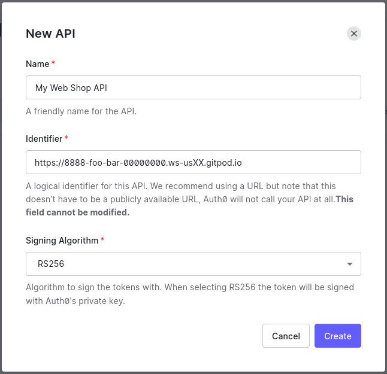
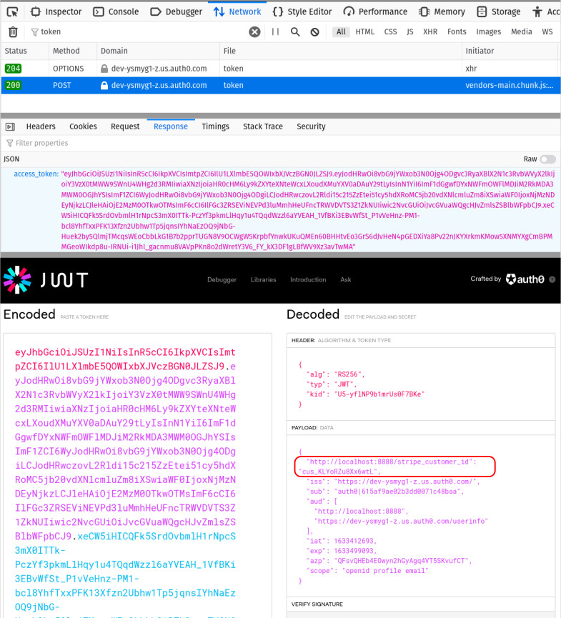

# Write Your Own Web Store In Hours


## Add the Stripe Customer ID to the Auth0 Access Token

In the next step, we'll write a lambda function to start a Stripe Checkout process, but how can we inject the user's Stripe Customer ID?

This is where the Access Token comes in. When a user logs in to your Auth0 tenent, an ID Token and Access Token are returned to the React app.

When we call our lambda function from React, we'll pass in the Access Token too, and therefore the lambda function will have the Stripe Customer ID, defining for whom this checkout flow is being created.

While we've configured Auth0 to manifest that Stripe Customer and save the ID to the `app_metadata` areas for the user, we haven't exposed this data in any of the tokens.

Let's do that now. Another Action will let us do this quite simply.


👉💻👈 Using the same process for creating the first Action, create another action to complete this. Want to try it for yourself? Here are the steps. I'll paste my code just under the note.

- [Create a new custom action](https://manage.auth0.com/#/actions/library)
- Give it a name, like "Add Stripe Customer ID to Access Token"
- This will also be triggered "Post Login"
- Check to see if `event.user.app_metadata.stripe_customer_id` is set
- If so, use `api.accessToken.setCustomClaim()` to add this to the access token
- Deploy your Action, and add it to the [Login Flow](https://manage.auth0.com/#/actions/flows)

💡 Note that custom claims must have fully qualified URLs for keys, for namespacing purposes.


Okay - here's the code I used:

```javascript
exports.onExecutePostLogin = async (event, api) => {
  if(event.user.app_metadata.stripe_customer_id) {
    api.accessToken.setCustomClaim(
      'http://localhost:8888/stripe_customer_id',
      event.user.app_metadata.stripe_customer_id
    );
  }
};
```

Quite straightforward, right?


## Tell Auth0 about the API

For security reasons, access tokens define a list of "audiences" or URLs for whom the token is intended. A system that receives a token not intended for it will ignore it.

So we need to tell Auth0 about our API, so that it can be included in the "audience" list.

👉💻👈 Head to [Applications > APIs](https://manage.auth0.com/#/apis) in the Auth0 dashboard, and create a new API.

> 📷 **_New API definition in Auth0_**
>
> 

There are a lot of powerful configuration options here, but for the purposes of this workshop, that's all you need to do here.

Now that our API is known by Auth0, we need the login process that's kicked off from our React app to specify our API as an intended audience.

👉💻👈 Edit `/src/index.js` and add the `audience` attribute to the `Auth0Provider` element:

```javascript
    <Auth0Provider
      domain="YOUR_AUTH0_DOMAIN"
      clientId="YOUR_AUTH0_CLIENT_ID"
      audience="http://localhost:8888"
      redirectUri={window.location.origin}
    >
      <App />
    </Auth0Provider>
```


🧪 If you want to test that this is working, logout and back in again while monitoring the Network tab in your browser's developer tools. You'll see a `POST` request to a `token` endpoint. The response of this request will contain an `acccess_token` which you can copy and paste into [jwt.io](https://jwt.io) to decode. You should see your Strpe Customer ID 🤞

> 📷 **_Finding the Stripe Customer ID in the Auth0 Access Token_**
>
> 

[▶️ STEP 9](./STEP-9-START-CHECKOUT.md)
